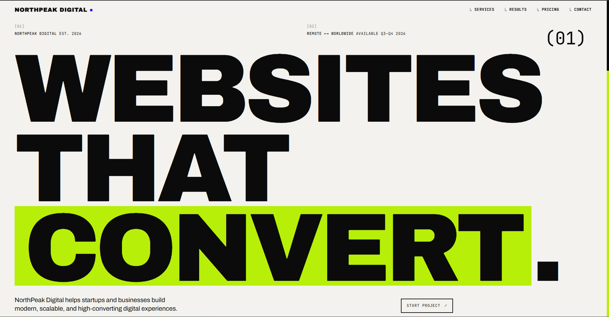
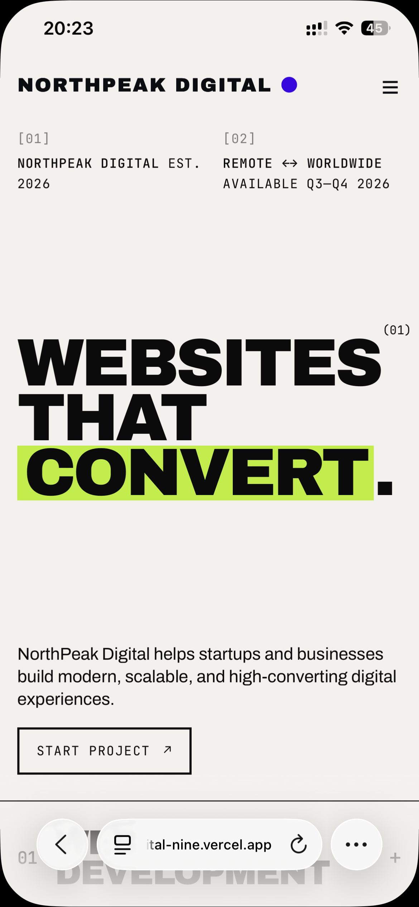

# NorthPeak Digital


NorthPeak Digital is a fictional digital agency website built as part of the Digital Heroes Web Development Internship Task (2026).

The project focuses on building a modern, responsive, and accessible one-page agency website while achieving high Lighthouse scores and following frontend best practices.

## Live Demo

- Live URL: https://northpeak-digital-nine.vercel.app/
- GitHub Repository: https://github.com/nikhil-dex/northpeak-digital

---
## Preview

### Desktop



### Mobile



## Overview

NorthPeak Digital helps startups and businesses build modern, scalable, and high-converting digital experiences.

The website includes:

- Hero section with CTA
- Services section (6 services)
- Results section
- Testimonials
- Pricing plans
- Contact form with client-side validation
- Fully responsive layout

---

## Tech Stack

- Next.js 16
- React
- CSS
- next/font/google
- Vercel

---

## Features

### Hero Section
- Large responsive typography
- Call-to-action button
- Brutalist-inspired design

### Services
- 6 service offerings:
  - Web Development
  - Shopify Development
  - SEO Optimization
  - UI/UX Design
  - Digital Marketing
  - Maintenance & Support

### Results
- 120+ Projects Delivered
- 98% Client Satisfaction
- 3.2x Average Growth
- 24/7 Support

### Testimonials
- Customer reviews
- Responsive card layout

### Pricing
- Starter
- Growth
- Enterprise

### Contact Form
- Client-side validation
- Email validation
- Success state handling

---

## Lighthouse Scores

| Metric | Score |
|-------|------|
| Performance | 100 |
| Accessibility | 94 |
| Best Practices | 100 |
| SEO | 100 |

---

## Responsiveness

The website has been tested and optimized for:

- 360px (Mobile)
- 768px (Tablet)
- 1440px (Desktop)

---

## Performance Optimizations

- Used Next.js App Router.
- Used `next/font/google` for optimized font loading.
- Implemented semantic HTML.
- Added Accessibility improvements including:
  - Semantic HTML
  - Proper heading hierarchy
  - Keyboard-friendly navigation
  - ARIA labels where applicable
  - Sufficient color contrast
- Used `clamp()` for responsive typography.
- Removed unnecessary JavaScript.
- Optimized production build using Vercel.
- Implemented responsive layouts using modern CSS.

---

## Deployment

- Hosted on Vercel
- Automatic deployments via GitHub integration

## Project Structure

```txt
app/
│
├── page.jsx
├── layout.js
├── globals.css
│
components/
├── Navbar.jsx
├── Hero.jsx
├── Services.jsx
├── Results.jsx
├── Testimonials.jsx
├── Pricing.jsx
├── Contact.jsx
└── Footer.jsx

lib/
└── fonts.js
```

---

## AI Usage

I used ChatGPT to:

- Brainstorm content and copy.
- Review accessibility considerations.
- Suggest Lighthouse optimization techniques.
- Review component structure and project organization.

All implementation, customization, and design decisions were completed and adapted by me.

---


## Future Improvements

Given additional time, I would consider:

- Implementing backend form submissions.
- Adding subtle animations using Framer Motion.
- Integrating analytics for visitor insights.
- Building an admin dashboard for lead management.
- Adding dark/light theme support.

---

## Assignment Requirement

This project was built for the Digital Heroes Web Development Internship Task.

Footer Requirement:

> Built for Digital Heroes Training Task

---

## Author

### Nikhil

- Portfolio: https://nikhil-dex.in
- GitHub: https://github.com/nikhil-dex
- Email: jincossec@gmail.com

---

Thank you for reviewing my submission.

## License

This project was created solely for the Digital Heroes Internship assignment and educational purposes.